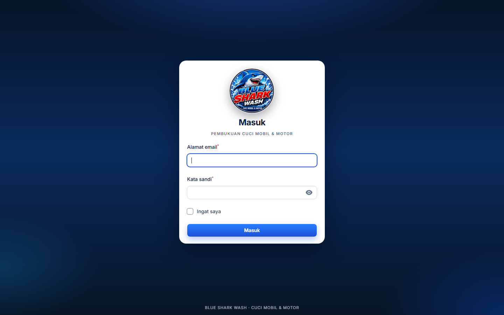
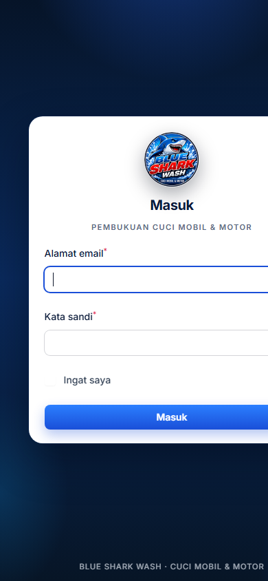

# Blue Shark Wash

Sistem pembukuan keuangan usaha cuci motor dan mobil. Bukan POS/kasir: admin menginput rekap operasional setelah usaha selesai.

Stack: Laravel 11, Filament 3, MySQL (sesuai environment proyek ini).

## Tampilan login

Halaman masuk panel admin (`/admin`). Kartu login menyesuaikan lebar layar; di layar pendek logo mengecil supaya tidak perlu scroll.

**Desktop**



**Ponsel**



## Menjalankan

```bash
composer install
copy .env.example .env
php artisan key:generate
php artisan migrate --seed
php artisan serve --host=127.0.0.1 --port=8101
```

Di `.env`, set `APP_URL=http://127.0.0.1:8101` (port **8101**, jangan 8080).

Panel admin: [http://127.0.0.1:8101/admin](http://127.0.0.1:8101/admin)

Akun seed:

- Owner: `owner@blueshark.test` / `password`
- Admin: `admin@blueshark.test` / `password`

Dokumentasi arsitektur, rumus, filter laporan (harian / mingguan / bulanan), dan pemetaan PRD ada di `docs/IMPLEMENTASI.md`.
PRD asli ada di `docs/PRD Sistem Pembukuan Keuangan Cuci Motor dan Mobil.md`.
